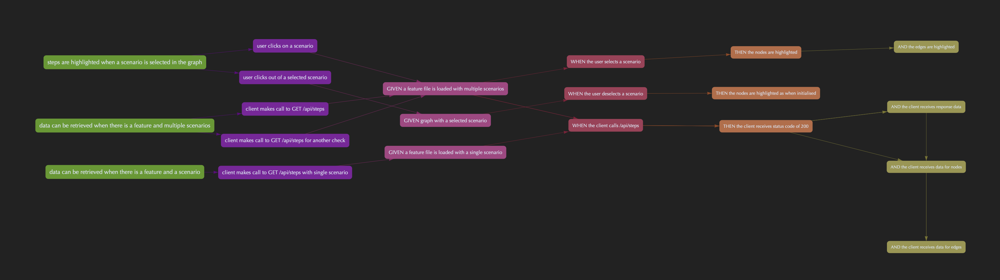
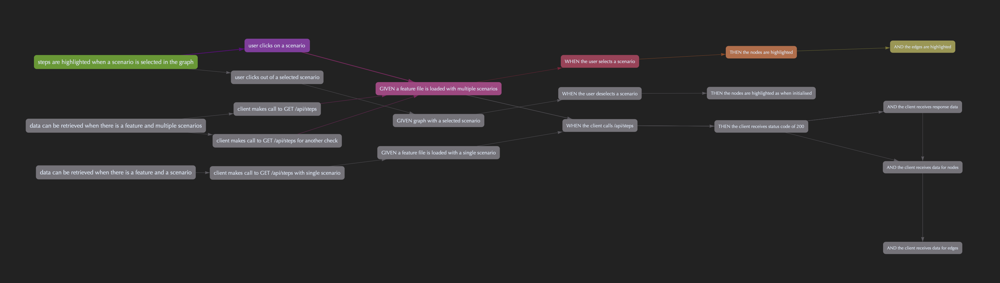
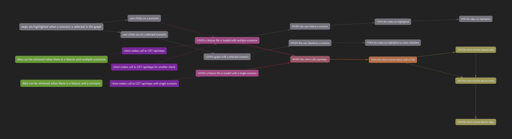

### Screenshots

Default view:

Scenario selected:

Step selected

### With the usage of

http://visjs.org/

Test examples from: 
https://automationpanda.com/2017/01/27/bdd-101-gherkin-by-example/